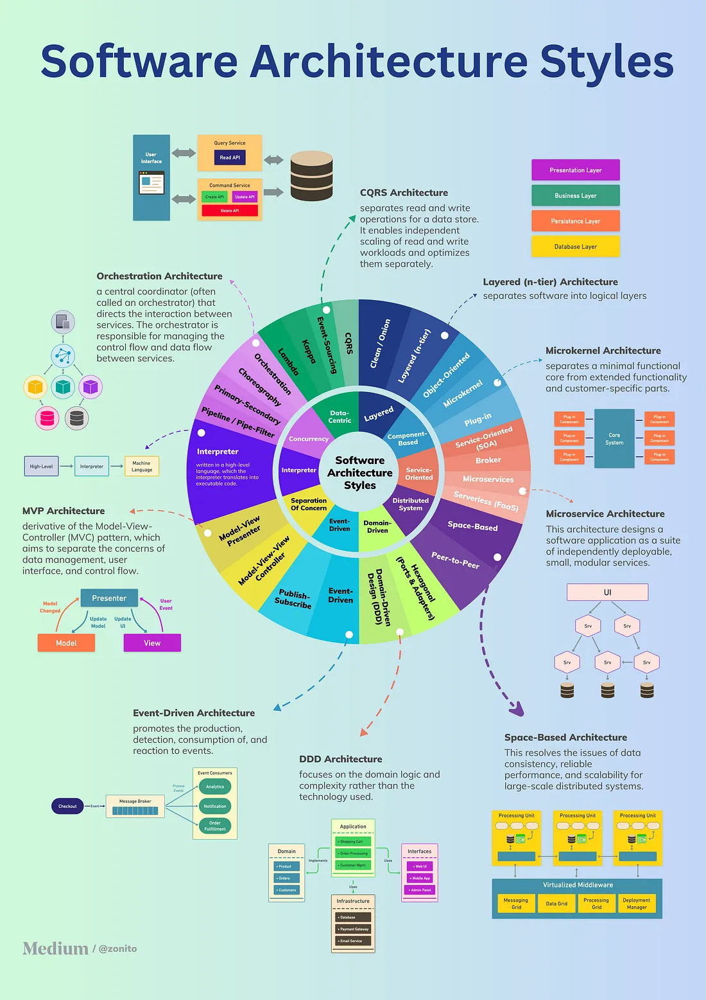
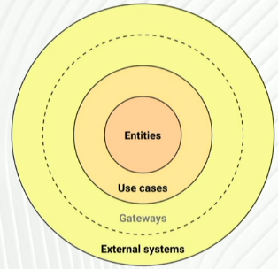
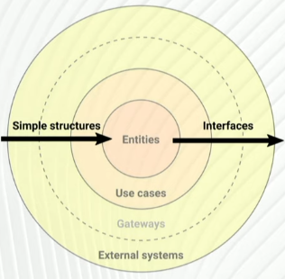

- Getting the Basics - Software Architecture Introduction
	- https://www.youtube.com/watch?v=8UlLgOf20Ho
	- Functional requirements: What should the system do?
	- Non-functional requirements: How should the system behave? (Functionality, Usability, Reliability, Efficiency, Maintainability, Scalability, Portability)
	- Restrictions (Legal Compliance, Cost, Standards, Talent Hiring, Time to Market)
	- Book - Software Architecture Patterns (O'Reilly)
- [The Architect’s Blueprint - Understanding Software Styles and Patterns with Cheatsheet](https://medium.com/bytebytego-system-design-alliance/the-architects-blueprint-understanding-software-styles-and-patterns-with-cheatsheet-5c1f5fd55bbd)
	- 

## API
- https://jsonapi.org/

### REST
- [How Did REST Come To Mean The Opposite of REST?](https://htmx.org/essays/how-did-rest-come-to-mean-the-opposite-of-rest/)
- [REST APIs must be hypertext-driven](https://roy.gbiv.com/untangled/2008/rest-apis-must-be-hypertext-driven)

## Clean Architectures in [Python ]()
- https://www.youtube.com/watch?v=C7MRkqP5NRI
- by Leonardo Giordani - https://thedigitalcatonline.com
- Archicture is about
  > Firmitas, Utilitas, Venustas (Durability, Utility, Beauty)
  > 
  > Vitruvius, De architecture, 15 BC
- Books suggestions
	- Object Oriented Software Engineering: A Use-Case Driven Approach - Ivar Jacobson
	- **Design Patterns** - E. Gamma, R. Helm, R. Johnson, J. Vlissides
	- Design Principles and Design Patterns - Robert Martin
	- Domain-Driven Design: Tackling Complexity in the Heart of Software - Eric Evans
	- **Enterprise Integration Patterns: Designing, Building, and Deploying Messaging Solutions** - H. Hohpe, B. Woolf
	- Clean Architecture in Python - Leonardo Giordani - bit.ly/getpycabook

### The Clean Architecture
- A **layered** approach for a more civilized age
  
- "Your component can see only what is being defined in the inner layer"
- "The problem of unclean systems is dependent components"
- The golden rule: Talk inward with **simple structures**, talk outwards through **interfaces**.
  
- Pros
	- Testability - be able to test only the business logic

### Django Architecture
- Mentioned unclean patterns
	- ORM that couples with Relational Databases - that's true
	- Models are aware/connected to the database (can be saved/retrieved natively) - partially true
		> When you test your Django application, you need the database. It's possible to test without the database, but you are sort of fighting against the framework.
		
	- "You usually implement your business logic in views" - That's not true. You can do it in every frameworks. But you should avoid in all, including Django. 

## Event-driven
- https://serverlessland.com/event-driven-architecture/visuals - Diagrams about event-driven architectures

## Security
### Basic Auth
### OAuth2
### OIDC
### Transport Security
- mTLS
- [Stunnel](https://www.stunnel.org/)
- VPN
	- [AWS VPN](https://aws.amazon.com/pt/vpn/)
	- [tailscale](https://tailscale.com/)
- 

## Software Development Hour: From Developer to Architect with Nathaniel Schutta
- O'Reilly
- Hosted by Sam Newman
- Differences between Engineer and Architect
	- Need to know more about company politics
	- Have to be more proactive - you need to go to the work
	- More autonomy and accountability
	- Architect needs to deal more with people
	- It's more common to work on PoCs than day-to-day coding
- Tips
	- Try to remove obstacles before it happens
	- Make sure people understand your job/value
	- Focus on skills that last (example: communication, influence)
	- You will need to influence - get people to do what you want by making them think it's his idea
	- You will not know all answers, but you need to know how research and who ask
	- You have a limited social capital (influence currency) - You need to choose your battles.
- How to bring global context to your local team? Help the team to see the big picture.
	- Translate the message (security, performance, etc) for the particular audience. Business will not care about tech. 
	- Maintenance - "Did you go to an airplane that didn't have maintenance for months/years?
- Book - How to win friend and influence people - It will help in your architecture role.
