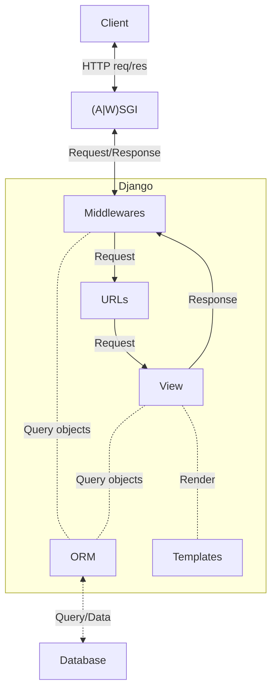

- [Snippet - Django password hashers time comparison](https://gist.github.com/lucasrcezimbra/69286c9f1cbdb355e242990d2bc85e02)
- [OWASP - Django Security Cheat Sheet](https://cheatsheetseries.owasp.org/cheatsheets/Django_Security_Cheat_Sheet.html)
- [Ninja](https://github.com/vitalik/django-ninja)
	- Fields selections [Issue](https://github.com/vitalik/django-ninja/issues/333)
- [Scaffold](https://github.com/Abdenasser/dr_scaffold)
- Avoid overwriting Model.delete. For example, overwriting to ensure soft delete (idea from [django-tenant-users](https://github.com/Corvia/django-tenant-users/blob/933c87dbad920d2c75666429ef37a552b15e9ac6/tenant_users/tenants/models.py#L404C1-L411C1)):
	```python
	def delete(self, *args, hard=False, **kwargs):
		if not hard:
			raise DeleteError("Use Model.soft_delete()")
		super().delete(*args, **kwargs)ht
	```

## Natural Key example
```diff
+class MyModelManager(models.Manager):
+    def get_by_natural_key(self, field1, field2):
+        return self.get(field1=field1, field2=field2)
+
+
 class MyModel(models.Model):
     created_at = models.DateTimeField(auto_now_add=True)
     updated_at = models.DateTimeField(auto_now=True)
     field1 = models.CharField(max_length=254)
     field2 = models.CharField(max_length=254)
+
+    objects = MyModelManager()
+
+    def natural_key(self):
+        return (self.field1, self.field2)
```

- How to test unmanaged models? [Source](https://stackoverflow.com/a/72593718)
	```python
	# conftest.py
	def pytest_sessionstart():
		from django.apps import apps

		unmanaged_models = [m for m in apps.get_models() if not m._meta.managed]

		for m in unmanaged_models:
			m._meta.managed = True

	# pyproject.toml
	[tool.pytest.ini_options]
	addopts = "--no-migrations"
	```
- `virtual_only` fields
	- Advantages: 1. Improved performance; 2. Consistent interface; 3. Compatibility with Django’s ORM; 4. Integration with serialization.
	- from https://henriquebastos.net/how-chatgpt-quickly-helped-me-understand-djangos-source-code
- `django.core.exceptions.ImproperlyConfigured: Cannot import '<app>'. Check that '<project>.<app>.apps.<App>Config.name' is correct.` #troubleshooting
	- Rename `<App>Config.name` from `<app>` to `<project>.<app>`
- [How to Switch to a Custom Django User Model Mid-Project](https://www.caktusgroup.com/blog/2019/04/26/how-switch-custom-django-user-model-mid-project/) and [Document how to migrate from a built-in User model to a custom User model](https://code.djangoproject.com/ticket/25313#comment:24)
## Admin
- [AdminLTE](https://github.com/wuyue92tree/django-adminlte-ui) - Admin dashboard template based on Bootstrap
- Awesome [1](https://github.com/iamfoysal/Best-Django-Admin-interface) and [2](https://github.com/originalankur/awesome-django-admin)
- [jazzmin](https://github.com/farridav/django-jazzmin) - AdminLTE 3 & Bootstrap 4
- [JET Reboot](https://github.com/assem-ch/django-jet-reboot) -
- [Semantic UI](https://github.com/globophobe/django-semantic-admin) - [Docs](https://globophobe.github.io/django-semantic-admin/)
- [Unfold Admin](https://unfoldadmin.com/) - [GitHub](https://github.com/unfoldadmin/django-unfold) - HTMX, Alpine.js and TailwindCSS
- [Volt](https://github.com/app-generator/django-admin-volt) - Based on Bootstrap 5

## Auth
- [django-allauth](https://docs.allauth.org/en/latest/)
- [social-app-django](https://github.com/python-social-auth/social-app-django)

## GraphQL Server
- [Ariadne](https://github.com/mirumee/ariadne-django)
	- Missing maintainer
- [Graphene](https://github.com/graphql-python/graphene-django/)
	- [docs](https://docs.graphene-python.org/projects/django/en/latest/)
	- Poor integration between Models and Queries
- [Strawberry](https://github.com/strawberry-graphql/strawberry-graphql-django)
	- Needs to define a schema class. Example:
    ```python
    @strawberry.django.type(models.Fruit)
    class Fruit:
        id: auto
        name: auto
        color: 'Color'
	  ```
- [Tartiflette](https://github.com/tartiflette/tartiflette-aiohttp)

## Health Check
- [django-health-check](https://github.com/revsys/django-health-check)
- [django-watchman](https://github.com/mwarkentin/django-watchman)

## Multi-tenancy
- django-tenants - [GitHub](https://github.com/django-tenants/django-tenants/)
	- Examples of projects using it: [bakeup](https://github.com/bruecksen/bakeup), [Zango](https://github.com/Healthlane-Technologies/Zango), [authentik](https://github.com/goauthentik/authentik/), [koku](https://github.com/project-koku/koku)
	- django-tenant-users - [GitHub]
		- Examples: [RPGnotes](https://github.com/Findus23/RPGnotes)

## Request/Response Cycle


## Servers
### ASGI
- [Daphne](https://github.com/django/daphne) - Django Channels HTTP/WebSocket server
- [Hypercorn](https://github.com/pgjones/hypercorn) -  ASGI and WSGI. Supports HTTP/1, HTTP/2, WebSockets (over HTTP/1 and HTTP/2). Can utilise asyncio, uvloop, or trio.
- [Mangum](https://github.com/jordaneremieff/mangum) - running ASGI applications in [AWS#Lambda]().
- [uvicorn](https://github.com/encode/uvicorn) - supports HTTP/1.1 and WebSockets.
### WSGI
- [gunicorn](https://github.com/benoitc/gunicorn)
- [Hypercorn](https://github.com/pgjones/hypercorn)

## Testing
- (pytest) How to define a project conftest (shared between all apps)?
	- The `conftest.py` must be in the same directory of `manage.py`

## Tree structures
- [django-mptt](https://github.com/django-mptt/django-mptt) - Utilities for implementing Modified Preorder Tree Traversal (This project is currently unmaintained)
- [django-tree](https://github.com/BertrandBordage/django-tree) - Fast and easy tree structures (In beta, it can’t be used yet in production.)
- [django-treebeard](https://github.com/django-treebeard/django-treebeard) - Efficient tree implementations
- [django-tree-queries](https://github.com/matthiask/django-tree-queries) - Adjacency-list trees using recursive common table expressions
