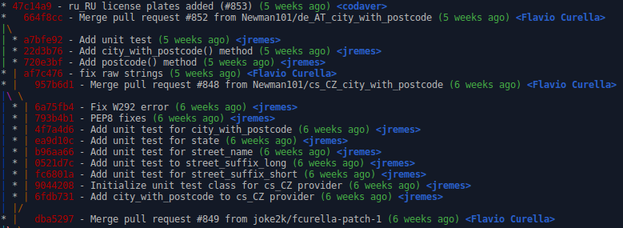

- Revert only one file
	```bash
	git checkout <commit_hash>~1 -- <path/to/file>
	git commit
	```

- Search for a commit in a deleted branch
	```bash
	git reflog --no-abbrev
	```

- Blame history before a commit
	```bash
	git blame <commit_hash>^ -- <path/to/file>
	```

- Search for a deleted code
	```bash
	git log -c -S'removed_code' <path/to/file> # search for string
	git log -c -G'removed.*code' <path/to/file> # search for regex
	```

- Edit a commit
	```bash
	git rebase -i '<commit_hash>^'
	# Change 'pick' to 'edit' in the commit to be edit.
	# Update the files.
	git commit --all --amend --no-edit
	git rebase --continue
	```

	- Undo a commit (uncommit)
	```bash
	git reset --soft HEAD^
	```

- Add changes to the last commit
	```bash
	git commit --amend
	```

- Better git log format
	```bash
	git config --global alias.lg "log --graph --pretty=format:'%Cred%h%Creset -%C(yellow)%d%Creset %s %Cgreen(%cr) %C(bold blue)<%an>%Creset'"
	git lg
	```
	

- Add some parts of a file
	```bash
	git add -p
	```

- Pull a branch squashing all remote commits
	```bash
	git pull --squash origin <branch>
	```

- Rewrite history updating commits author name and e-mail
	```bash
	git filter-branch --env-filter '
		OLD_EMAIL="<the old e-mail>"
		CORRECT_NAME="<the new name>"
		CORRECT_EMAIL="<the new e-mail>"
	
		if [ "$GIT_COMMITTER_EMAIL" = "$OLD_EMAIL" ]
		then
			export GIT_COMMITTER_NAME="$CORRECT_NAME"
			export GIT_COMMITTER_EMAIL="$CORRECT_EMAIL"
		fi
		if [ "$GIT_AUTHOR_EMAIL" = "$OLD_EMAIL" ]
		then
			export GIT_AUTHOR_NAME="$CORRECT_NAME"
			export GIT_AUTHOR_EMAIL="$CORRECT_EMAIL"
		fi' -- origin/HEAD..HEAD
	```

- Fixing down merge conflicts
  ```bash
  export FROM=<branch>
  export TO=<branch>
  git checkout $TO
  git pull --ff-only origin $TO
  git branch -D downmerge-$FROM-to-$TO
  git checkout -b downmerge-$FROM-to-$TO
  git pull origin $FROM
  # fix conflicts
  git commit
  git push origin downmerge-$FROM-to-$TO
  ```

## Trunk based
- https://trunkbaseddevelopment.com/#one-line-summary
- [Transitioning to Trunk Based Development]() - https://devcycle.com/blog/transitioning-to-trunk-based-development

## Versioning
- Conventional Commits - https://www.conventionalcommits.org
	- [GitHub]() action: https://github.com/amannn/action-semantic-pull-request
- Semantic Versioning - https://semver.org/