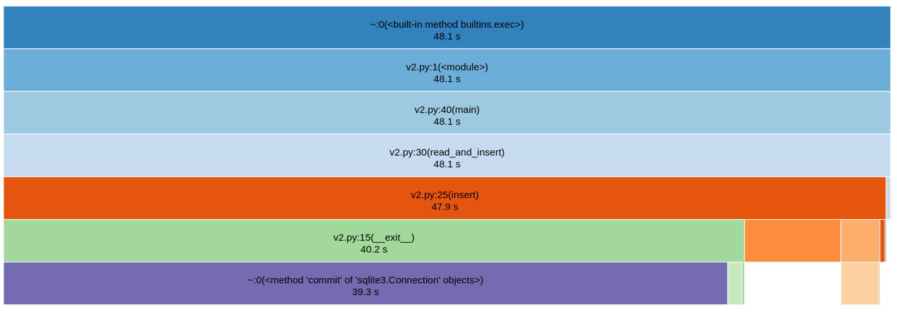

+++
date = 2022-04-20T15:30:00-03:00
title = "Como utilizar o cProfile e o SnakeViz para encontrar gargalos na sua aplicação Python"
+++

Publicado originalmente na 1ª edição da [Revista HBNetwork](https://sites.google.com/view/revista-hbnetwork).


## O cProfile e o SnakeViz

O *[cProfile](https://docs.python.org/3/library/profile.html#module-cProfile)* é uma das ferramentas *built-in* do *Python* que serve para gerar estatísticas sobre o número de chamadas e o tempo de execução das funções de um programa, ou seja, para realizar aquilo que conhecemos por *profiling*.

A ferramenta pode ser usada pela linha de comando para gerar uma saída em texto (conforme ilustrado na imagem abaixo) que pode ser usada para descobrir os gargalos de um sistema. Porém, para facilitar a interpretação da saída do *cProfile*, podemos usar o *[SnakeViz](https://github.com/jiffyclub/snakeviz)*.


O *SnakeViz*, por sua vez, é uma biblioteca de terceiros e pode ser [instalada *via pip*](https://pypi.org/project/snakeviz/), sua função é ler o output do *cProfile* e gerar gráficos. Ao ser executada, a ferramenta criará um servidor web local e assim poderemos acessar os gráficos pelo browser.


A seguir demonstrarei como podemos usar o *cProfile* e o *SnakeViz* para fazer o *profiling* de um *script* Python e como podemos otimizar o *script* e remover os gargalos.

## Tutorial

### Script

Neste exemplo, consideraremos um *CSV* com duas colunas nomeadas como *id* e *name*. O *script* deverá ler diariamente milhões de linhas desse arquivo *CSV* e inseri-las em um banco de dados, porém, se o *id* já estiver no banco, devemos descartar a linha.

A versão atual leva aproximadamente 1 minuto para processar 10.000 linhas. Este tempo não está satisfatório e é preciso otimizá-lo.

Esta é a versão atual do *script*:

```python
# people.py

import csv
import sqlite3

FILENAME = 'people.csv'
DATABASE = 'people.sqlite'

class Cursor:
    def __init__(self, database=DATABASE):
        self.db = sqlite3.connect(DATABASE)

    def __enter__(self, *args, **kwargs):
        return self.db.cursor()

    def __exit__(self, *args, **kwargs):
        self.db.commit()
        self.db.close()

def create_database():
    with Cursor() as cursor:
        cursor.execute('CREATE TABLE IF NOT EXISTS people (id uuid, name text)')

def exists(id):
    with Cursor() as c:
        results = c.execute('SELECT * FROM people WHERE id=:id', {"id": id}).fetchall()
        return bool(results)

def insert(id, name):
    with Cursor() as c:
        c.execute('INSERT INTO people VALUES (:id, :name)', {'id': id, 'name': name})

def read_and_insert():
    with open(FILENAME) as f:
        reader = csv.reader(f, delimiter=';', quotechar='"')
        for id, name in reader:
            if not exists(id):
                insert(id, name)

def main():
    create_database()
    read_and_insert()
```

Neste *script* temos 1 classe e 5 funções. São elas:

- `Cursor`: *wrapper* do *sqlite3* para funcionar como um *ContextManager*;
- `create_database`: responsável por criar a tabela *people* no banco, se esta não existir;
- `exists`: retorna *True* se o *id* já existir na tabela ou *False* se não existir;
- `insert`: insere a linha na tabela;
- `read_and_insert`: lê o arquivo *CSV*, itera pelas linhas verificando se já está no banco, se não estiver, insere.

### Executando o profiling

Nesta etapa rodamos o *script* em conjunto com o *profiling* para entendermos os tempos de execução de cada tarefa:

```bash
python -m cProfile -o v1.cprof people.py
```

- [`python -m`](https://docs.python.org/3/using/cmdline.html#cmdoption-m) executa um módulo;
- `cProfile` é o módulo que queremos executar;
- `-o v1.cprof` é um argumento que indica ao *cProfile* para escrever o resultado no arquivo `v1.cprof` ao invés de escrever no *stdout*;
- `people.py` é o script que queremos executar e fazer o profiling.

Após rodar esse comando teremos um arquivo `v1.cprof` no diretório atual. Para lê-lo primeiro instalamos o *SnakeViz* via *pip*:

```bash
pip install snakeviz
```

Logo após, executamos o *SnakeViz* passando o arquivo `v1.cprof` como parâmetro:

```bash
snakeviz v1.cprof
```

Ao executar deve-se abrir uma página no navegador com o seguinte gráfico:


Este gráfico nos mostra quanto tempo foi gasto em cada função. A partir dele podemos perceber que:

- O processo inteiro levou 78 segundos;
- As funções `main` e `read_and_insert` também levaram 78 segundos, pois são as principais funções do script e tudo é chamado a partir delas;
- A maior parte do tempo foi gasto nas funções `exists` e `insert`, sendo mais da metade (~44 segundos) na função `exists`.

Ao analisarmos o gráfico temos uma pista de onde podemos começar a otimização. Dado que mais da metade do tempo foi gasto na função `exists`, a primeira otimização ocorrerá a partir dela.

### Primeira Otimização

Se conhecermos um pouco de SQL, podemos alterar nosso *schema* do banco de dados, para obrigar a unicidade do campo `id`. Assim, podemos inserir a linha na tabela e caso dê erro de *constraint*, ignoramos aquela linha. Dessa forma podemos remover a função `exists`, nosso maior gargalo atual, e assim eliminar várias chamadas ao banco.

Nosso primeiro passo será alterar a função `create_database` para obrigar a unicidade do campo `id`:

```diff
def create_database():
    with Cursor() as cursor:
-       cursor.execute('CREATE TABLE IF NOT EXISTS people (id uuid, name text)')
+       cursor.execute('CREATE TABLE IF NOT EXISTS people (id uuid, name text, UNIQUE(id))')
```

Em seguida, alteramos a função `read_and_insert` para capturar as exceções de *constraint* ao invés de chamar a função `exists`:

```diff
def read_and_insert():
    with open(FILENAME) as f:
        reader = csv.reader(f, delimiter=';', quotechar='"')
        for id, name in reader:
-           if not exists(id):
+           try:
                insert(id, name)
+           except sqlite3.IntegrityError:
+               pass
```

E por fim, removemos a função `exists`, que perdeu sua utilidade:

```diff
-def exists(id):
-    with Cursor() as c:
-        results = c.execute('SELECT * FROM people WHERE id=:id', {"id": id}).fetchall()
-        return bool(results)
```

Como alteramos o *schema* do banco de dados (e neste projeto não temos *migrations*), precisamos apagar o *sqlite* atual antes de rodar novamente:

```bash
# Ctrl-C para parar de rodar o snakeviz
rm people.sqlite
```

Após essas alterações podemos analisar o desempenho novamente:

```bash
python -m cProfile -o v2.cprof people.py
snakeviz v2.cprof
```



E assim percebemos que:

- O processo inteiro levou ~48 segundos (~30 segundos a menos que a primeira versão);
- As funções `main` e `read_and_insert` levaram o mesmo tempo do processo como esperado;
- A função `exists` não aparece mais no gráfico, pois foi removida do código;
- Agora a maior parte do tempo (~48 segundos) foi gasta na função `insert`; especificamente no `*method 'commit' of 'sqlite3...*` que fica dentro do `Cursor.__exit__.`
    
    
    

### Segunda Otimização

Analisemos a função `insert` e a classe `Cursor`:

```python
class Cursor:
    def __init__(self, database=DATABASE):
        self.db = sqlite3.connect(DATABASE)

    def __enter__(self, *args, **kwargs):
        return self.db.cursor()

    def __exit__(self, *args, **kwargs):
        self.db.commit()
        self.db.close()

...

def insert(id, name):
    with Cursor() as c:
        c.execute('INSERT INTO people VALUES (:id, :name)', {'id': id, 'name': name})
```

A cada chamada à função `insert` são executadas as seguintes funções nesta ordem:

1. `Cursor.__init__`: conecta com o banco;
2. `Cursor.__enter__`*:* abre um cursor com o banco;
3. `cursor.execute`: executa o SQL no banco;
4. `Cursor.__exit__`: faz o *commit* no banco e depois fecha a conexão.

A função que consome mais recursos nessa nova versão do script é a `sqlite3.Connection.commit`, chamada dentro do `Cursor.__exit__`.

Não é necessário fazer um *commit* no banco de dados a cada *insert*: podemos alterar o código para inserir todas as linhas e ao final fazer somente um *commit*.

Alteramos o `insert` para receber um *cursor* aberto ao invés de abrir e fechar um a cada execução:

```diff
-def insert(id, name):
-    with Cursor() as c:
-        c.execute('INSERT INTO people VALUES (:id, :name)', {'id': id, 'name': name})

+def insert(cursor, id, name):
+    cursor.execute('INSERT INTO people VALUES (:id, :name)', {'id': id, 'name': name})
```

Alteramos a criação do cursor para o início da função `read_and_insert` e o passamos como parâmetro para a função `insert`:

```diff
 def read_and_insert():
-    with open(FILENAME) as f:
-        reader = csv.reader(f, delimiter=';', quotechar='"')
-        for id, name in reader:
-            try:
-                insert(id, name)
-            except sqlite3.IntegrityError:
-                pass
+    with Cursor() as cursor:
+        with open(FILENAME) as f:
+            reader = csv.reader(f, delimiter=';', quotechar='"')
+            for id, name in reader:
+                try:
+                    insert(cursor, id, name)
+                except sqlite3.IntegrityError:
+                    pass
```

A partir destas alterações, as funções (`Cursor.__init__`, `Cursor.__enter__` e `Cursor.__exit__`) que estavam lentas serão chamadas apenas uma vez durante toda a execução do script.

Agora é o momento do *profiling*:

```bash
# Ctrl-C para parar de rodar o snakeviz
python -m cProfile -o v3.cprof people.py
snakeviz v3.cprof
```


Devido à significativa alteração de tempo, cheguei a pensar que havia rodado errado, então rodei mais uma vez, verifiquei se havia mesmo inserido no *SQLite* e estava tudo certo. Ter alterado essas linhas para o *commit* rodar somente uma vez fez o tempo de processamento de 10.000 linhas baixar de 48 para 0,249 segundos. Fiz um outro teste processando 100.000 linhas e o tempo foi de 0,611 segundos:


Ao olharmos para o gráfico, vemos que as funções `insert` e `execute` são as principais ofensoras agora, mas proponho esta otimização como um exercício para o leitor.

### A necessidade faz a otimização

Otimização pode se tornar uma diversão. Pensar em como eliminar gargalos e ver a performance melhorar gradativamente é gratificante, mas lembre-se de otimizar só o necessário para atingir seu propósito.

Nem sempre faz sentido otimizar a performance do seu software. Muitas vezes, entregar rapidamente uma solução mais lenta é melhor para o seu negócio, do que gastar recursos para desenvolver algo mais performático que não agregará valor ao produto.

Como disse Donald Knuth: “Otimização precoce é a raiz de todos os males.”

> Premature optimization is the root of all evil.
> 

Otimize só quando houver métricas que demonstrem a necessidade.

Os códigos desse tutorial estão no meu Github: https://github.com/lucasrcezimbra/tutorial-cprofile-snakeviz
