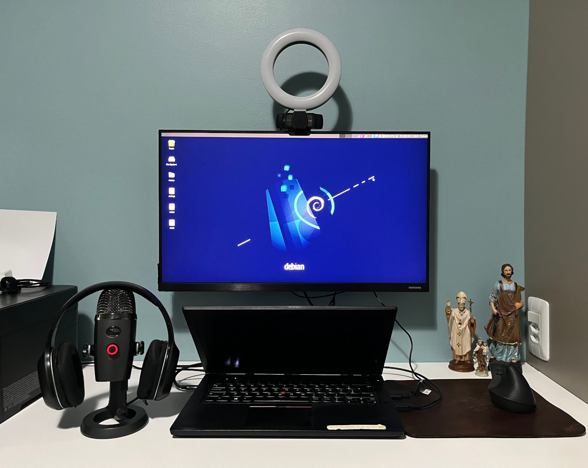

## Meu Setup

 <!-- begin columns block -->

<---> <!-- column separator -->

* Notebook Thinkpad T480
    * Intel Core i5
    * 16 GB RAM
    * SSD HP S700 250GB
    * [Debian Bullseye](https://www.debian.org/releases/bullseye/)
* [Monitor LG LED 23"](https://www.lg.com/br/monitores/lg-23MB35VQ) no [Suporte ELG F80N](https://a.co/d/5s1SwBV)
* [Webcam Logitech C920s](https://a.co/d/jgwzInX) + [Ring Light](https://produto.mercadolivre.com.br/MLB-1794696234-anel-de-luz-ring-light-clip-celular-mesa-14-cm-articulado-_JM)
* [Headphone Edifier W800BT](https://edifier.com.br/headphone-w800bt-plus-bluetooth-5-1-over-ear-edifier-preto.html) + [Microfone Boya BY-M1](https://a.co/d/j1yTSn9)
* [Mouse Logitech M100](https://www.logitech.com/pt-br/products/mice/m100-usb-mouse.910-001601.html)
* [Hub Baseus 6 em 1](https://produto.mercadolivre.com.br/MLB-2027205008-hub-6-em-1-type-c-hdmi-4k-rj45-macbook-m1-_JM)
* [Mesa dF Metal Arts](https://www.instagram.com/dfmetalarts/) e [Cadeira Plaxmetal Brizza Presidente](https://plaxmetal.com.br/produtos/brizza-presidente/)
* Papel e Caneta
* Ao fundo, [A Mão de São José](https://www.santalberti.com.br/produtos/quadro-poster-a-mao-de-sao-jose/), por [Matheus Bazzo](https://www.instagram.com/matheus.bazzo/)


